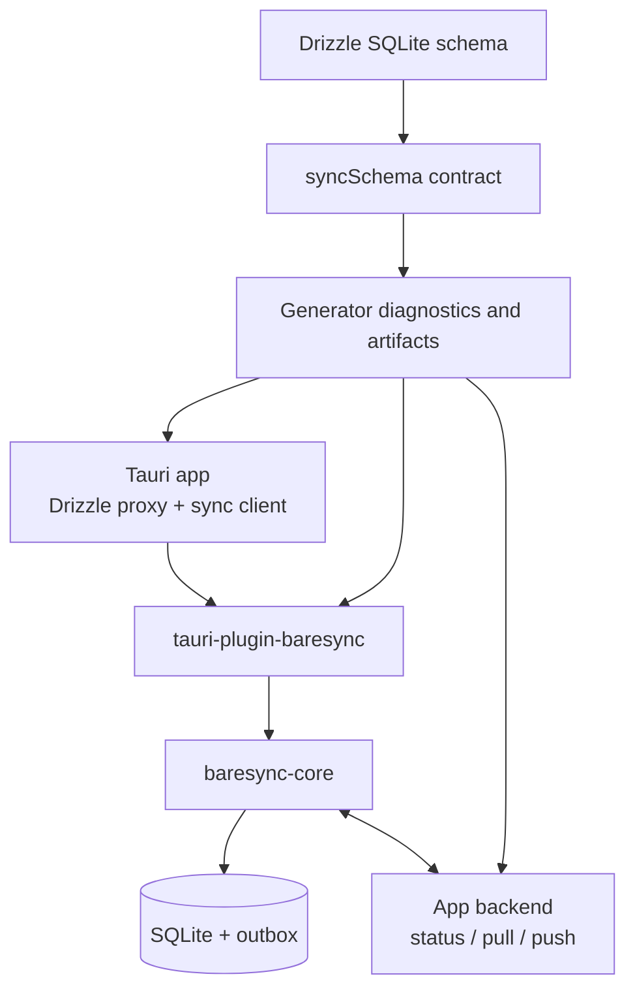

# Baresync

SQLite-first sync infrastructure for Tauri apps.

Baresync is an opinionated sync stack for applications that keep working data in local SQLite and reconcile it with an app-owned backend. It combines Drizzle schema helpers, a generated sync contract, a Rust sync engine, a Tauri plugin, and server helpers for push, pull, and status routes.

The project is currently pre-release and private-package oriented inside this repository. The public package name is `baresync`; the workspace still uses `@repo/baresync` internally during development.

## Why Baresync Exists

Local-first Tauri apps tend to grow the same sync plumbing repeatedly:

- SQLite setup and migrations.
- Drizzle access through Tauri IPC.
- Dirty-row tracking and outbox handling.
- Push chunking and idempotency.
- Pull cursors and soft deletes.
- Parent/child table ordering.
- Server route envelopes, limits, and encoding.
- Desktop and Android fixture verification.

Baresync turns that plumbing into a reusable contract and runtime while leaving product-specific access control and persistence rules in your app.

## What It Provides

- Drizzle SQLite helpers for declaring synced tables and row-state columns.
- Contract diagnostics for primary keys, row state, scope columns, foreign keys, table order, and encoding support.
- Generated artifacts including `sync-contract.json`, `sync-table-order.ts`, manifests, and optional protobuf workspace files.
- A Rust core engine for status, push, pull, full sync, full resync, outbox cleanup, and garbage collection.
- A Tauri plugin that owns SQLite, migrations, Drizzle proxy commands, and sync commands.
- Server utilities for JSON/protobuf decoding, response encoding, payload limits, idempotency, cursor helpers, and handler factories.
- Fixture app and smoke automation for desktop and Android verification.

## Current Scope

Baresync is intentionally narrow for v1:

- Tauri apps.
- SQLite/libSQL local data.
- Drizzle SQLite schemas.
- Consumer-owned backend routes.
- Generated sync contracts.
- JSON as the baseline transport, with protobuf support where generated adapters are wired.

It is not a hosted sync service, generic ORM, generic SQLite plugin, or database-agnostic replication engine.

## How It Works



The app defines synced Drizzle tables, generates a contract, registers the Tauri plugin with contract metadata, queries SQLite through the plugin, and calls sync commands for a concrete `scopeId`.

The backend remains app-owned. Baresync helps with request/response structure, idempotency, ordering, limits, and encoding, but your server still decides which sync scope a request can use and how rows are persisted.

## Repository Layout

| Path                           | Purpose                                                                               |
| ------------------------------ | ------------------------------------------------------------------------------------- |
| `packages/baresync`            | TypeScript package: schema helpers, generator, DB proxy, server helpers, Tauri client |
| `crates/baresync-core`         | Rust sync engine and SQLite runtime                                                   |
| `crates/tauri-plugin-baresync` | Tauri plugin wrapper and command surface                                              |
| `tests/fixture-app`            | Public fixture Tauri app used for desktop and Android smoke flows                     |
| `tests/e2e`                    | Fixture backend, generated protobuf workspace, desktop and Android automation         |
| `apps/docs`                    | Waku + Fumadocs documentation site                                                    |
| `docs`                         | Planning notes, runbooks, and implementation knowledge                                |
| `openspec`                     | Archived and active spec-driven change artifacts                                      |

## Quick Start

Start with [`examples/inventory`](./examples/inventory). It is the canonical fullstack starter in this repository and uses the public `baresync` npm package plus the `tauri-plugin-baresync` Rust crate.

```txt
fieldkit/
  package.json
  apps/
    app/            # initialized with `bun create tauri-app`
      src/
      src-tauri/
    server/         # initialized with `bun create elysia`
      src/
  packages/
    sync-contract/
      package.json
      src/schema.ts
      sync.config.ts
      sync-proto.config.ts
      generate-protobuf.ts
      generated/
```

The shared contract package is where Drizzle tables, Baresync metadata, and generated artifacts live. The Tauri app consumes it for local SQLite access and plugin configuration. The Elysia server consumes it for table order and request/response handling.

Define synced tables in the shared contract package:

```ts title="packages/sync-contract/src/schema.ts"
// packages/sync-contract/src/schema.ts
import { localSyncRowState, syncedTable, syncSchema } from "baresync/schema";
import { integer, sqliteTable, text } from "drizzle-orm/sqlite-core";

export const categories = sqliteTable("categories", {
  id: text("id").primaryKey(),
  workspaceId: text("workspace_id").notNull(),
  name: text("name").notNull(),
  sortOrder: integer("sort_order").notNull().default(0),
  ...localSyncRowState,
});

export const syncedCategories = syncedTable(categories, {
  scope: "workspace_id",
  localOnlyColumns: ["isSynced"],
});

export const syncContract = syncSchema({
  packageName: "example.sync.v1",
  tables: [syncedCategories],
});
```

Export the contract from a generator config. The CLI loads either a default export or a named `contract` export:

```ts title="packages/sync-contract/sync.config.ts"
// packages/sync-contract/sync.config.ts
export { syncContract as default } from "./src/schema";
```

Expose the schema and generated artifacts from the shared package:

```json title="packages/sync-contract/package.json"
{
  "//": "packages/sync-contract/package.json",
  "name": "@repo/sync-contract",
  "private": true,
  "type": "module",
  "exports": {
    ".": "./src/schema.ts",
    "./generated/sync-table-order": "./generated/sync-table-order.ts",
    "./generated/sync-contract": "./generated/sync-contract.json",
    "./generated/manifest": "./generated/sync-contract.manifest.json"
  }
}
```

Run diagnostics and generation from the monorepo root. The generated files land in `packages/sync-contract/generated`.

```bash
bunx baresync doctor ./packages/sync-contract/sync.config.ts
bunx baresync generate ./packages/sync-contract/sync.config.ts --output ./packages/sync-contract/generated
```

If you use protobuf, add a protobuf workspace config. This mirrors the fixture config in `tests/e2e/sync-proto.config.ts`.

```ts title="packages/sync-contract/sync-proto.config.ts"
// packages/sync-contract/sync-proto.config.ts
import { dirname, join } from "node:path";
import { fileURLToPath } from "node:url";
import type { ProtobufWorkspaceConfig } from "baresync/generator";
import { syncContract } from "./src/schema";

const packageRoot = dirname(fileURLToPath(import.meta.url));
const outputDir = join(packageRoot, "generated", "protobuf");

export const protobufWorkspaceConfig = {
  contract: syncContract,
  outputDir,
  outputs: {
    proto: join(outputDir, "proto", "sync.proto"),
    runtimeSourceTs: join(outputDir, "runtime.ts"),
    runtimeTs: join(outputDir, "runtime.generated.ts"),
    rustSyncMappers: join(
      packageRoot,
      "..",
      "..",
      "apps",
      "app",
      "src-tauri",
      "src",
      "protobuf_generated.rs",
    ),
    syncTs: join(outputDir, "sync.generated.ts"),
  },
} satisfies ProtobufWorkspaceConfig;

export default protobufWorkspaceConfig;
```

Then create a small runner so generation and drift checks use the same config.

```ts title="packages/sync-contract/generate-protobuf.ts"
// packages/sync-contract/generate-protobuf.ts
import { generateProtobufWorkspaceArtifacts } from "baresync/generator";
import protobufWorkspaceConfig from "./sync-proto.config";

generateProtobufWorkspaceArtifacts(protobufWorkspaceConfig);
```

Run it when the sync schema changes:

```bash
bun ./packages/sync-contract/generate-protobuf.ts
```

Use the Tauri client from the app created with `bun create tauri-app`:

```ts title="apps/app/src/sync.ts"
// apps/app/src/sync.ts
import { createSyncClient } from "baresync/tauri";
import { invoke } from "@tauri-apps/api/core";

const sync = createSyncClient({
  apiUrl: "https://api.example.com",
  encoding: "json",
  scopeId: "default",
  invoke,
});

await sync.syncNow();
```

Wire routes in the server created with `bun create elysia`:

```ts title="apps/server/src/sync-routes.ts"
// apps/server/src/sync-routes.ts
import { Elysia } from "elysia";
import {
  createSyncPullHandler,
  createSyncPushHandler,
  createSyncStatusHandler,
} from "baresync/server";
import { SYNC_UPSERT_ORDER } from "@repo/sync-contract/generated/sync-table-order";
import { serverDb } from "./server-db";

async function resolveScope({
  context,
  scopeId,
}: {
  context: {
    session: Session;
  };
  scopeId: string;
}) {
  const scope = await resolveUserSyncScope(context.session, scopeId);
  if (!scope) {
    return {
      ok: false as const,
      status: 403,
      body: { error: "forbidden" },
    };
  }

  return { ok: true as const, scope };
}

export const push = createSyncPushHandler({
  encoding: "json",
  idempotency: { db: serverDb },
  upsertOrder: SYNC_UPSERT_ORDER,
  resolveScope,
  applyPushChanges: async ({ changes, scope, syncUpdatedAt }) => {
    return pushTablesWithAppOwnedOperations({
      changes,
      scope,
      syncUpdatedAt,
    });
  },
});

export const pull = createSyncPullHandler({
  encoding: "json",
  limit: 1000,
  resolveScope,
  loadPullChanges: async ({ cursor, limit, scope, tables }) => {
    return loadChangedRows({
      cursor,
      limit,
      scope,
      tables,
    });
  },
});

export const status = createSyncStatusHandler({
  encoding: "json",
  resolveScope,
  loadSyncStatus: async ({ cursor, scope }) => {
    return loadSyncStatus({
      cursor,
      scope,
    });
  },
});

export const syncRoutes = new Elysia({ prefix: "/sync" })
  .derive(async ({ headers }) => {
    return {
      session: await readSession(headers),
    };
  })
  .post("/push", ({ request, session }) => {
    return push(request, { session });
  })
  .post("/pull", ({ request, session }) => {
    return pull(request, { session });
  })
  .post("/status", ({ request, session }) => {
    return status(request, { session });
  });
```

The backend still owns authorization and persistence. Baresync decodes envelopes, validates push limits, orders table changes, wraps idempotent push handling, and encodes responses. The idempotency guard expects the `sync_batch_requests` table from `syncServerSchema` to exist in the server database.

Read the documentation site in `apps/docs` for the fuller integration path.

## Development

Install dependencies:

```bash
bun install
```

Run the docs site:

```bash
cd apps/docs
bun run dev
```

Run the standard checks:

```bash
bun x ultracite check
bun run typecheck
cd apps/docs && bun run types:check && bun run build
```

Publishing to npm and crates.io remains a manual maintainer action after the build and package verification steps pass.

Additional verification lives in the fixture and E2E workspaces. Before changing desktop, Android, Tauri, fixture app, fixture backend, or smoke automation, read `docs/knowledge/E2E-TESTING-RUNBOOK.md`.

## Design Principles

- Keep SQLite local interaction fast and explicit.
- Keep sync contracts generated and reviewable.
- Keep server access control and persistence app-owned.
- Prefer deterministic host tests before desktop or Android smoke tests.
- Treat JSON and protobuf as encodings of the same contract.
- Do not hide durable generation behind build magic.

## Status

Baresync is in active extraction and hardening. The core runtime, plugin wrapper, fixture app, protobuf generation path, and documentation site exist in this repo, but publishing metadata, release automation, and public API stability are still pending.

Do not treat the current workspace package names as final release guarantees.
