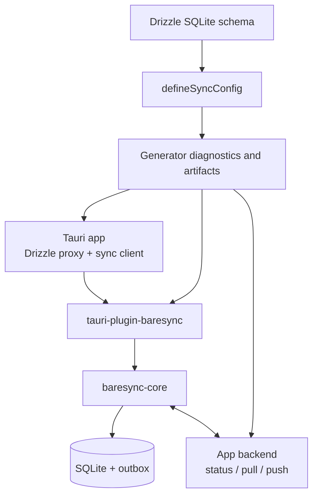

<div align="center">
  <a href="https://baresync.hieka.id/">
    
  </a>
  <br />
  <br />
  <a href="https://www.npmjs.com/package/baresync"></a>
  <a href="https://crates.io/crates/baresync-core"></a>
  <a href="https://crates.io/crates/tauri-plugin-baresync"></a>
  <a href="https://github.com/sakti-dev/baresync/blob/main/LICENSE"></a>
  <br />
  <br />
  <strong>SQLite sync for Tauri apps. You own the backend.</strong>
  <br />
  <br />
  <a href="https://baresync.hieka.id/docs/getting-started/quick-start">Quickstart</a>
  <span>&nbsp;&nbsp;•&nbsp;&nbsp;</span>
  <a href="https://baresync.hieka.id/">Website</a>
  <span>&nbsp;&nbsp;•&nbsp;&nbsp;</span>
  <a href="https://baresync.hieka.id/docs/getting-started/introduction">Docs</a>
  <span>&nbsp;&nbsp;•&nbsp;&nbsp;</span>
  <a href="https://github.com/sakti-dev/baresync/tree/main/examples">Examples</a>
  <span>&nbsp;&nbsp;•&nbsp;&nbsp;</span>
  <a href="https://github.com/sakti-dev/baresync">GitHub</a>
  <br />
  <hr />
</div>

Baresync is an opinionated sync stack for applications that keep working data in local SQLite and reconcile it with an app-owned backend. It combines Drizzle schema helpers, a generated sync contract, a Rust sync engine, a Tauri plugin, and server helpers for push, pull, and status routes.

The TypeScript package is published as `baresync`, with Rust crates published as `baresync-core` and `tauri-plugin-baresync`.

## Why Baresync Exists

Building a local-first Tauri app is easy. Making it sync with your server is not.

You need a local database, a way to track what changed, a protocol to push and pull changes, conflict resolution, ordering for tables with foreign keys, and server routes that handle all of it safely. Every team that builds this ends up writing the same plumbing from scratch.

Baresync gives you that plumbing as a reusable package. You define your tables in Drizzle, generate a sync contract, and get a working sync engine — client, plugin, and server helpers — out of the box. You keep full control over auth, scope, and persistence. Baresync handles the rest.

## What It Provides

- Drizzle SQLite helpers for declaring synced tables and row-state columns.
- Contract diagnostics for primary keys, row state, scope columns, foreign keys, table order, and conflict strategies.
- Generated artifacts including `sync-contract.json`, `sync-table-order.ts`, and manifests.
- A Rust core engine for status, push, pull, full sync, full resync, outbox cleanup, and garbage collection.
- A Tauri plugin that owns SQLite, migrations, Drizzle proxy commands, and sync commands.
- Server utilities for decoding, payload limits, idempotency, cursor helpers, and handler factories.
- A Drizzle repository helper for building server-side push/pull/status handlers.

## Current Scope

Baresync is intentionally narrow for v1:

- Tauri apps.
- SQLite/libSQL local data.
- Drizzle SQLite schemas.
- Consumer-owned backend routes.
- Generated sync contracts.
- JSON transport.

It is not a hosted sync service, generic ORM, generic SQLite plugin, or database-agnostic replication engine.

## How It Works



The app defines synced Drizzle tables, generates a contract, registers the Tauri plugin with contract metadata, queries SQLite through the plugin, and calls sync commands for a concrete `scopeId`.

The backend remains app-owned. Baresync helps with request/response structure, idempotency, ordering, and limits, but your server still decides which sync scope a request can use and how rows are persisted.

## Repository Layout

| Path                           | Purpose                                                                 |
| ------------------------------ | ----------------------------------------------------------------------- |
| `packages/baresync`            | TypeScript package: schema helpers, generator, DB proxy, server helpers |
| `crates/baresync-core`         | Rust sync engine and SQLite runtime                                     |
| `crates/tauri-plugin-baresync` | Tauri plugin wrapper and command surface                                |
| `tests/fixture-app`            | Fixture Tauri app used for desktop and Android smoke flows              |
| `tests/e2e`                    | Fixture backend, desktop and Android automation                         |
| `apps/docs`                    | Waku + Fumadocs documentation site                                      |
| `docs`                         | Planning notes, runbooks, and implementation knowledge                  |
| `openspec`                     | Archived and active spec-driven change artifacts                        |

## Quick Start

Start new projects with `create-baresync`:

```bash
bun create baresync@latest
```

The scaffold prompts for project name and server framework, then creates a monorepo:

```txt
my-app/
├── apps/
│   ├── app/          # Tauri app (React/Vite, SolidJS/Vite, etc.)
│   └── server/       # Hono/Elysia backend
└── packages/
    └── sync-contract/  # shared schemas + generated contract
```

Define local synced tables in the shared contract package:

```ts title="packages/sync-contract/src/local-synced-schema.ts"
// packages/sync-contract/src/local-synced-schema.ts
import { localSyncColumns } from "baresync/schema";
import { integer, sqliteTable, text } from "drizzle-orm/sqlite-core";

export const categories = sqliteTable("categories", {
  id: text("id").primaryKey(),
  workspaceId: text("workspace_id").notNull(),
  name: text("name").notNull(),
  sortOrder: integer("sort_order").notNull().default(0),
  ...localSyncColumns(),
});
```

Define the API-side synced table shape separately:

```ts title="packages/sync-contract/src/api-synced-schema.ts"
// packages/sync-contract/src/api-synced-schema.ts
import { apiSyncColumns } from "baresync/schema";
import { integer, sqliteTable, text } from "drizzle-orm/sqlite-core";

export const categories = sqliteTable("categories", {
  id: text("id").primaryKey(),
  workspaceId: text("workspace_id").notNull(),
  name: text("name").notNull(),
  sortOrder: integer("sort_order").notNull().default(0),
  ...apiSyncColumns(),
});
```

Create the generator config from both synced schema views:

```ts title="packages/sync-contract/sync.config.ts"
// packages/sync-contract/sync.config.ts
import { defineSyncConfig } from "baresync/generator";
import * as apiSyncedSchema from "./src/api-synced-schema";
import * as localSyncedSchema from "./src/local-synced-schema";

export const syncGeneratorConfig = defineSyncConfig({
  apiSyncedSchema,
  localSyncedSchema,
  outputDir: "./generated",
  packageName: "example.sync.v1",
  tables: {
    categories: { scopeColumn: "workspace_id" },
  },
});
```

Run diagnostics and generation from the contract package directory. The CLI discovers `sync.config.ts` automatically when you are in the right folder.

```bash
cd packages/sync-contract
bunx baresync doctor
bunx baresync generate
```

Set up the Drizzle proxy for local SQLite access:

```ts title="apps/app/src/lib/db.ts"
// apps/app/src/lib/db.ts
import { invoke } from "@tauri-apps/api/core";
import { createTauriDrizzleDatabase } from "baresync/db";
import {
  items,
  locations,
} from "@example/inventory-sync-contract/local-synced-schema";
import {
  syncOutbox,
  syncCursors,
} from "@example/inventory-sync-contract/local-synced-schema";

const TABLE = { items, locations, syncOutbox, syncCursors };

export const db = createTauriDrizzleDatabase({ schema: TABLE, invoke });
```

Use the Tauri sync client:

```ts title="apps/app/src/sync.ts"
// apps/app/src/sync.ts
import { createSyncClient } from "baresync/tauri";
import { invoke } from "@tauri-apps/api/core";

const sync = createSyncClient({
  scopeId: "default",
  invoke,
});

await sync.syncNow();
```

Wire routes in the server created with `bun create hono`:
```ts title="apps/server/src/v1/routes.ts"
// apps/server/src/v1/routes.ts
import { Hono } from "hono";
import { createSyncServer } from "baresync/server";
import {
  createDrizzleSyncRepository,
  optionalString,
  requiredString,
} from "baresync/server/drizzle";
import { db } from "../db/client";
const resolveScope = ({ scopeId }: { scopeId: string }) => {
  if (scopeId !== "default") {
    return {
      ok: false as const,
      status: 403,
      body: { error: "single_scope_only" },
    };
  }
  return { ok: true as const, scope: { scopeId } };
};
const repository = createDrizzleSyncRepository({
  tables: {
    locations: {
      buildRow: ({ row, scopeId, syncUpdatedAt, updatedAt }) => ({
        id: requiredString(row.id, "locations.id"),
        name: requiredString(row.name, "locations.name"),
        scopeId,
        syncUpdatedAt,
        updatedAt,
      }),
      readLatestRow: async ({ scopeId }) => {
        /* query by scopeId */
      },
      readRows: ({ cursorTimestamp, scopeId }) => {
        /* query changed rows */
      },
      softDeleteRow: async ({ id, syncUpdatedAt, updatedAt }) => {
        /* soft delete */
      },
      upsertRow: async (row) => {
        /* insert or update */
      },
    },
  },
});
const syncServer = createSyncServer({
  db,
  resolveScope,
  push: {
    upsertOrder: repository.tableNames,
    applyPushChanges: async ({ changes, scope, syncUpdatedAt }) =>
      repository.applyPushChanges({
        changes,
        scopeId: scope.scopeId,
        syncUpdatedAt,
      }),
  },
  pull: {
    limit: 1000,
    loadPullChanges: async ({ cursor, scope, tables }) =>
      repository.loadPullChanges({ cursor, scopeId: scope.scopeId, tables }),
  },
  status: {
    loadSyncStatus: async ({ cursor, scope }) =>
      repository.loadSyncStatus({ cursor, scopeId: scope.scopeId }),
  },
});
const sync = new Hono();
sync.post("/push", (c) => syncServer.push(c.req.raw, {}));
sync.post("/pull", (c) => syncServer.pull(c.req.raw, {}));
sync.post("/status", (c) => syncServer.status(c.req.raw, {}));
export default sync;
```
`createSyncServer` is the preferred batteries-included integration path. For custom protocol work, use the low-level primitives exported from `baresync/server`.

The backend still owns authorization and persistence. Baresync decodes envelopes, validates push limits, orders table changes, and wraps idempotent push handling. The `resolveScope` function is where you check authorization — the handler factories call it on every request.

Read the documentation site in `apps/docs` for the fuller integration path.

## Concepts

### Local-first

Your app reads from and writes to a local SQLite database. No network request is needed to display data or create a record.

### Outbox pattern

Every local write that needs to sync goes through `writeLocalChange`. This performs the mutation and an outbox entry atomically. If the network is down, the entry waits. When connectivity returns, the sync engine pushes pending changes.

### Sync modes

The engine picks one of five modes on each `sync_now` call:

- **NoOp** — Nothing to sync.
- **PushOnly** — Local writes pending, no server changes.
- **PullOnly** — No local writes, server has changes.
- **FullSync** — Both sides have changes. Pull first, then push.
- **FullResync** — First sync or explicit refresh. Pulls all data, then pushes outbox.

### Paired schemas

Each synced table has two Drizzle schemas:

- **Local** — uses `localSyncColumns()` which adds `deletedAt`, `isSynced`, `createdAt`, `updatedAt`
- **API** — uses `apiSyncColumns()` which adds `deletedAt`, `syncUpdatedAt`, `createdAt`, `updatedAt`

### Scope

Every synced row belongs to a scope (tenant, workspace, etc.). The server's `resolveScope` function checks that the requesting user has access to the requested scope.

## Development

Install dependencies:

```bash
bun install
```

Run the docs site:

```bash
cd apps/docs
bun run dev
```

Run the standard checks:

```bash
bun x ultracite check
bun run typecheck
cd apps/docs && bun run types:check && bun run build
```

Measure test coverage:

```bash
bun run coverage:js
bun run coverage:rust
bun run coverage
```

The JS coverage command uses Bun's built-in coverage reporting. The Rust coverage command uses `cargo llvm-cov` and currently runs `baresync-core` and `tauri-plugin-baresync` separately on this machine because full workspace coverage hits local disk limits here.

Last measured in this checkout:

- JS/Bun coverage: 95.36% lines, 93.56% functions
- `baresync-core`: 56.46% lines, 51.08% functions
- `tauri-plugin-baresync`: 35.36% lines, 21.43% functions

Publishing to npm and crates.io remains a manual maintainer action after the build and package verification steps pass.

Additional verification lives in the fixture and E2E workspaces. Before changing desktop, Android, Tauri, fixture app, fixture backend, or smoke automation, read `docs/knowledge/E2E-TESTING-RUNBOOK.md`.

## Design Principles

- Keep SQLite local interaction fast and explicit.
- Keep sync contracts generated and reviewable.
- Keep server access control and persistence app-owned.
- Prefer deterministic host tests before desktop or Android smoke tests.
- Do not hide durable generation behind build magic.
