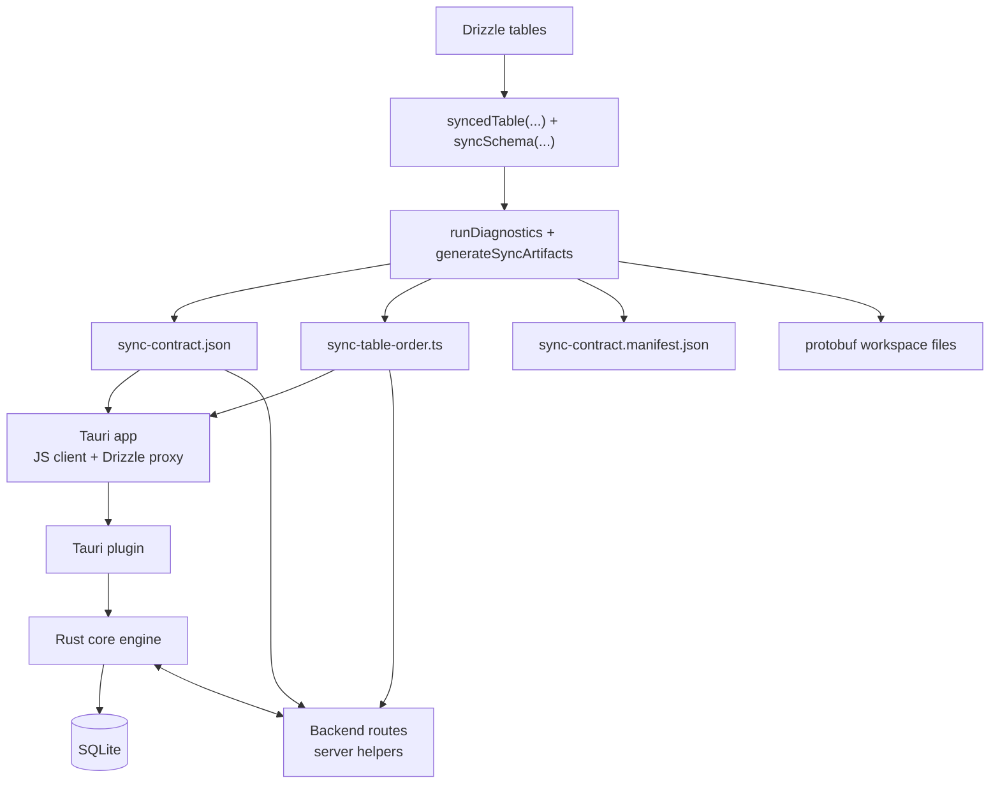
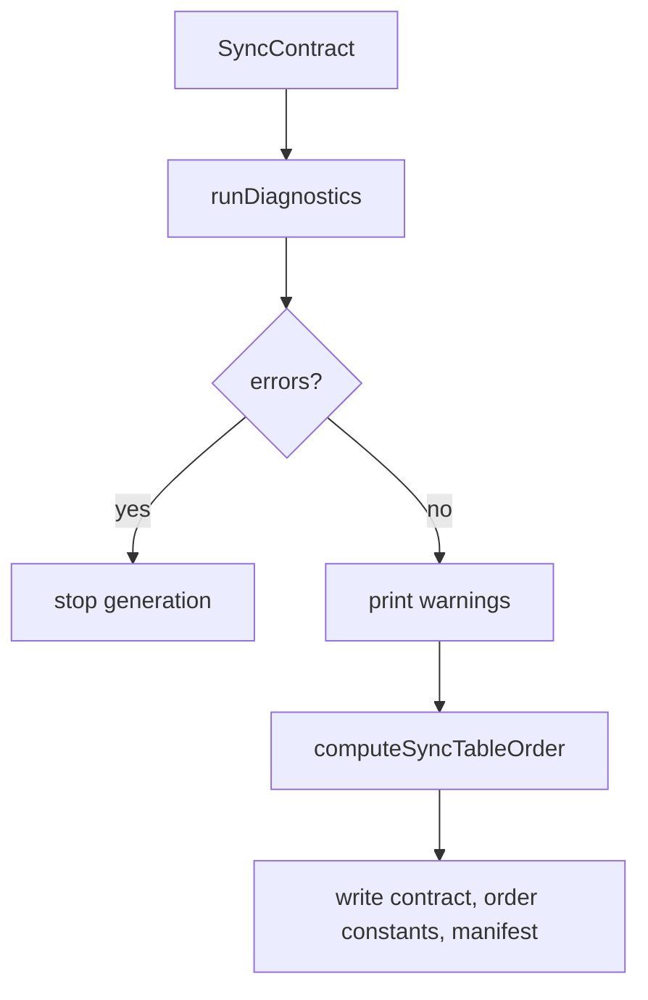
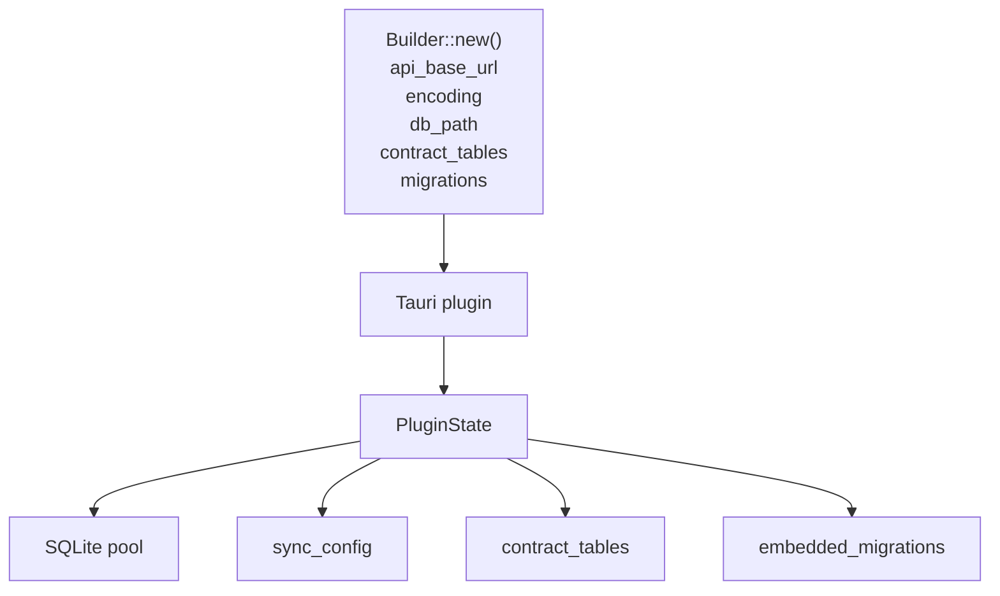
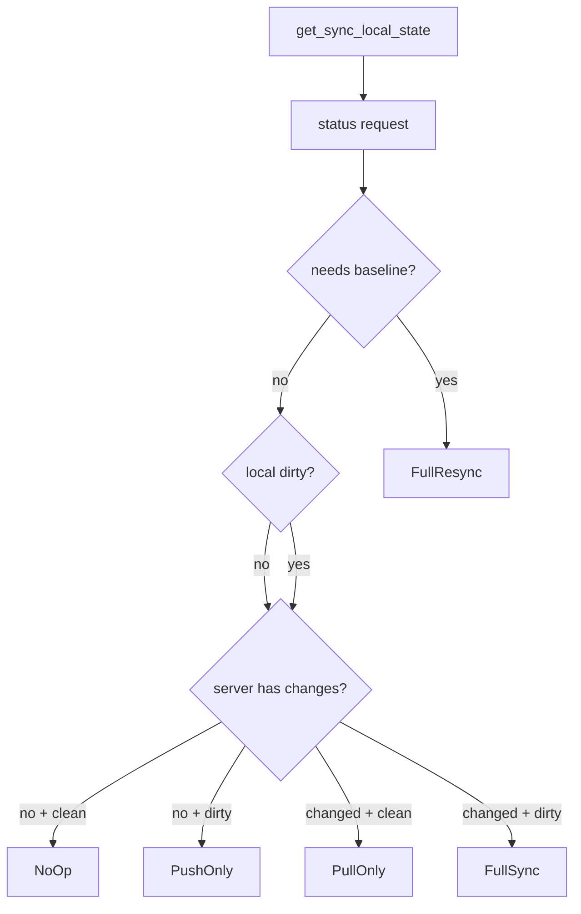
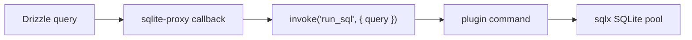
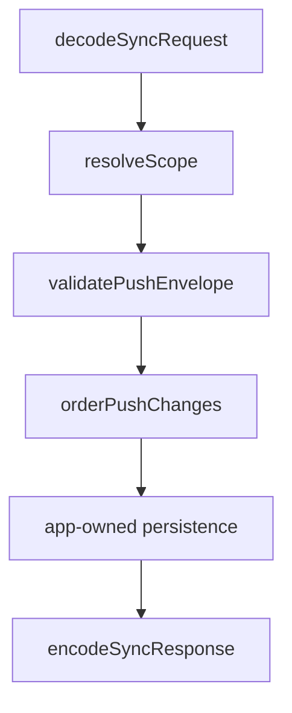

Baresync has three runtime areas and one generation area: TypeScript contract/generator code, a Rust core sync engine, a Tauri plugin wrapper, and server helpers for backend routes.

## System map

## Package boundaries

The workspace package exports separate surfaces:

- `@repo/baresync/schema` for schema helpers and server-side idempotency schema.
- `@repo/baresync/generator` for diagnostics, table-order computation, manifests, and protobuf workspace generation.
- `@repo/baresync/db` for Drizzle-over-Tauri SQLite proxy access.
- `@repo/baresync/server` for sync route primitives and handler factories.
- `@repo/baresync/tauri` for the frontend sync client.
- `@repo/baresync/limits` for shared default limits.

## Generator flow

Generation starts from a `SyncContract`. Diagnostics run before files are written.

The table order comes from Drizzle foreign keys. Upsert order is topological; delete order is reversed.

## Tauri plugin flow

Plugin setup connects SQLite, creates plugin state, stores embedded migrations, and keeps contract table metadata for future commands.

Each sync command creates a `SyncEngine` with the requested `scopeId`. This keeps scope selection explicit at the command boundary.

## Sync engine flow

`sync_now` first gets local state, then calls the server status endpoint. It uses that decision to avoid unnecessary network work.

Pull applies changed rows in upsert order and soft-deletes in delete order. Push reads pending outbox changes, chunks them, sends idempotent envelopes, marks accepted rows synced, and handles server-wins rejection by pulling rejected tables.

## Drizzle proxy flow

`createTauriDrizzleDatabase` uses Drizzle's `sqlite-proxy` adapter. Queries are not sent to a remote SQL API; they are sent to the trusted local Tauri command bridge.

Batch statements go through `run_sql_batch`.

## Server helper flow

Server helpers keep the HTTP boundary predictable while leaving business logic in your backend.

The higher-level handler factories package this shape for push, pull, and status routes.

## Encoding boundary

JSON is the runtime baseline. Protobuf generation emits `.proto`, TypeScript runtime wrappers, schema metadata, and Rust mapper structs. The fixture app uses a protobuf transport adapter to translate between the Rust engine's JSON-shaped values and protobuf HTTP payloads.
