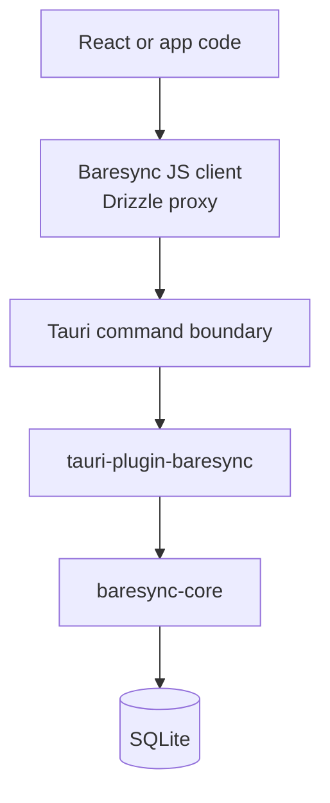

Baresync is built around a few explicit contracts. The library does not hide sync behind a generic data layer; it makes the app declare synced tables, scope boundaries, generated table order, local row state, and server responsibilities.

## Sync contract

The sync contract starts from `defineSyncConfig`, which pairs local synced schema and API synced schema modules. It records package name, encoding, limits, synced tables, local-only columns, server-only columns, and table metadata extracted from Drizzle.

Generation turns that into files such as:

- `sync-contract.json`
- `sync-table-order.ts`
- `sync-contract.manifest.json`
- protobuf runtime files when protobuf generation is enabled

The contract is protocol code. Treat generated drift like a real compatibility change.

## Table shape

Every synced table needs a single text `id` primary key. Diagnostics reject composite primary keys, integer primary keys, missing primary keys, duplicate table names, and unsupported column types.

A synced table also needs a scope column. The scope column maps a row to an app-owned boundary such as merchant, outlet, tenant, workspace, or user sandbox. Baresync does not decide what the boundary means; it only carries the `scopeId` through local and server sync.

## Row-state model

Baresync uses row-state sync semantics. The local database and server-side tables have related but different needs.

Local row state:

- `deleted_at` for soft deletion.
- `is_synced` for local dirty state.
- `created_at` for temporal state.
- `updated_at` for conflict and reconciliation decisions.

Server/API row state:

- `deleted_at` for soft deletion.
- `sync_updated_at` for cursor ordering.
- `created_at` and `updated_at` for row history.

The supported helpers are `localSyncColumns()` and `apiSyncColumns()`. Diagnostics require local dirty tracking, API-side sync watermarks, and matching local/API schema views after declared local-only and server-only columns are excluded.

## Local database responsibilities

The local SQLite database is the app's fast interaction layer. The Rust core connects with WAL mode, foreign keys enabled, a busy timeout, and a single SQLite pool connection so Drizzle proxy transactions stay safe.

The plugin exposes:

- `run_sql`
- `run_sql_batch`
- `run_migrations`
- `get_migration_status`
- `get_db_info`
- `get_sync_local_state`
- `sync_now`
- `sync_push`
- `sync_pull`
- `sync_full_resync`
- `purge_synced_outbox`
- `run_garbage_collection`

App code normally reaches `run_sql` and `run_sql_batch` through `createTauriDrizzleDatabase`.

## Outbox and cursors

Local writes are pushed from `sync_outbox`. The engine reads pending rows per table in generated upsert order, builds push units, derives an idempotency key from outbox IDs, chunks by row and byte limits, and clears accepted outbox rows after the server acknowledges them.

Pull progress is tracked by a cursor shaped like:

```txt
sync:<timestamp>:<tableName>:<rowId>
```

Stored pulls advance the local cursor. Baseline pulls start from an empty cursor and are used for full resyncs and rejected server-wins tables.

## Server responsibilities

The server remains app-owned. Baresync does not replace your authorization, tenancy, or persistence rules.

The server helpers make the sync boundary consistent:

- Decode requests.
- Validate envelopes and limits.
- Order push changes.
- Encode responses.
- Support idempotent push handling.
- Map common sync errors to stable codes.
- Parse and format sync cursors.

Handler factories wrap those primitives for `push`, `pull`, and `status`, but your backend still implements `resolveScope`, `applyPushChanges`, `loadPullChanges`, and `loadSyncStatus`.

## Sync modes

`syncNow` is not a blind pull-then-push. It checks local dirty state and server status first:

- `NoOp`: local clean, server clean.
- `PushOnly`: local dirty, server clean.
- `PullOnly`: local clean, server changed.
- `FullSync`: both sides changed.
- `FullResync`: baseline pull is needed.

If a push response rejects rows because the server wins, the engine baseline-pulls those rejected tables to bring local state back to the server version.

## Encoding model

JSON is the default. The core Rust push path currently builds JSON envelopes. Protobuf support exists in generator and server utilities, and the fixture app proves protobuf transport by adapting the JSON-shaped engine payloads through generated protobuf mappers.

Protobuf should be treated as another encoding of the same contract, not a different sync protocol.

## Tauri plugin boundary

The Rust runtime sits behind a normal Tauri plugin. Plugin registration owns the API base URL, encoding, push limits, SQLite path, embedded migrations, and sync table metadata.



## Generated table order

Baresync computes table order from Drizzle foreign keys. Parents are upserted before children, and deletes run in reverse order. Required foreign keys to non-synced tables are rejected; nullable external foreign keys are allowed; cycles are rejected.
