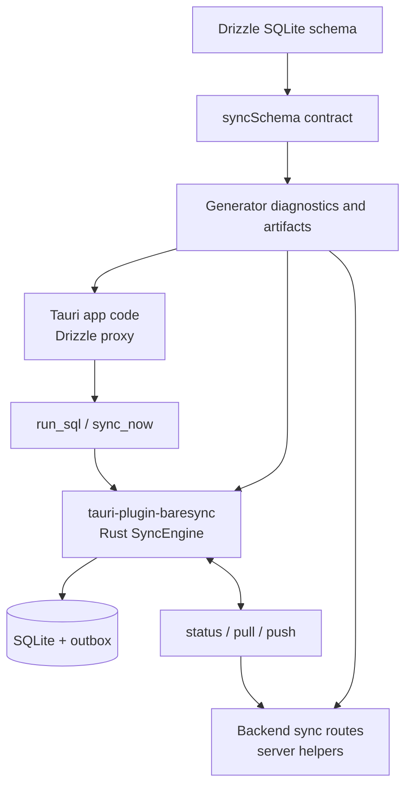

Baresync is an extracted sync runtime for Tauri apps that keep their working data in local SQLite. It connects four pieces that usually become app-specific glue: a Drizzle schema, a generated sync contract, a Rust sync engine behind a Tauri plugin, and server handlers owned by your backend.

If you want the canonical copyable starter, use [`examples/inventory`](https://github.com/sakti-dev/baresync/tree/main/examples/inventory).

The current package is still private in this repo as `@repo/baresync`. These docs describe the library as it exists now, with public-package naming called out where it is still intended rather than published.

## What Baresync gives you

- `syncedTable` and `syncSchema` helpers for turning Drizzle SQLite tables into a sync contract.
- Generator diagnostics for required row-state columns, primary keys, table order, foreign keys, and encoding support.
- Generated artifacts such as `sync-contract.json`, `sync-table-order.ts`, protobuf metadata, and Rust protobuf mappers.
- A Rust core engine that performs status, pull, push, full resync, outbox cleanup, and SQLite reconciliation.
- A Tauri plugin that exposes sync commands plus local SQLite proxy commands for Drizzle.
- Server helpers for JSON and protobuf request decoding, response encoding, idempotent push handling, cursor parsing, payload limits, and handler factories.

## Who it is for

Use Baresync when your Tauri app needs local writes, offline tolerance, and eventual sync with an application-owned backend.

It fits products such as POS systems, field operations tools, inventory software, and desktop-first business apps where local SQLite should keep the UI fast even when the network is unreliable.

## What it is not

Baresync is not a hosted sync service, generic ORM, generic Tauri SQLite plugin, or database-agnostic replication engine.

It also does not own your tenant model, authorization rules, or backend persistence semantics. The server helpers give structure to the sync boundary, but your app still decides whether a `scopeId` is valid and how incoming rows are applied.

For v1, the center of gravity is narrow: Tauri, SQLite, Drizzle SQLite tables, generated sync contracts, and app-owned backend routes.

## Runtime shape

The local app talks to SQLite through Tauri IPC. The plugin owns the SQLite pool, runs migrations, proxies Drizzle queries, and creates a `SyncEngine` per requested `scopeId`.

The engine chooses a sync mode by comparing local state with the server status endpoint:

- `NoOp` when local state is clean and the server reports no changes.
- `PushOnly` when there are local outbox rows and the server is clean.
- `PullOnly` when local state is clean and the server reports changes.
- `FullSync` when both sides have work.
- `FullResync` when the local cursor needs a baseline pull.

## System map

Start with [Quickstart](/docs/quickstart) if you want the happy path, or [Concepts](/docs/concepts) if you want the vocabulary first.
