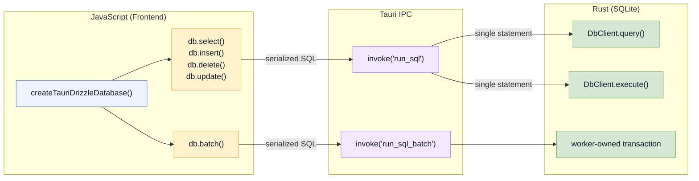

# Local Database Overview

Every Baresync Tauri app has a local SQLite database that stores your synced tables, the outbox, cursors, and client identity. You never manage this database directly — Baresync provides a Drizzle ORM proxy that routes queries through Tauri IPC to the Rust layer.

## Architecture



## What's in the database

| Category | Tables | Created by |
|---|---|---|
| Your synced tables | `items`, `locations`, etc. | Migrations (you define them) |
| Outbox | `sync_outbox` | Generated migration |
| Cursors | `sync_cursors` | Generated migration |
| Client identity | `sync_client_identity` | Plugin startup |
| Migration tracking | `__drizzle_migrations` | Migration system |

## Connection settings

The Rust layer configures SQLite with:

- **WAL journal mode** — allows concurrent reads during writes
- **Normal synchronous mode** — balances safety and performance
- **Foreign keys ON** — enforces referential integrity
- **5-second busy timeout** — retries on lock contention
- **Single worker-owned connection** — prevents concurrent write conflicts

## Optional encryption at rest

Encryption is opt-in. If you do not configure an encryption key provider, Baresync opens a normal plaintext SQLite database.

For the full setup flow, failure cases, and Rust API shape, see [Database Encryption](/docs/local-database/encryption).

## Database path

Default: `baresync.db` in the app's current working directory. Configure it on the builder:

```rust
builder.db_path("data/my-app.db")
```

For a Tauri v2 app, you typically resolve the path from the app data directory:

```rust
use tauri::Manager;

builder.db_path(app.path().app_data_dir().unwrap().join("sync.db").to_str().unwrap())
```

## In this section

| Page | What it covers |
|---|---|
| [Create Tauri Drizzle Database](/docs/local-database/create-tauri-drizzle-database) | Setting up the JS Drizzle proxy |
| [Table Registry Pattern](/docs/local-database/table-registry-pattern) | Organizing your Drizzle schema |
| [Transactions](/docs/local-database/transactions) | Batching writes via `writeTransaction` and `db.batch` |
| [Database Encryption](/docs/local-database/encryption) | SQLCipher setup, key providers, and startup ordering |
| [Migrations](/docs/local-database/migrations) | How Baresync runs SQL migrations at startup |
| [DB Info](/docs/local-database/db-info) | Checking database size and path |
| [Debugging](/docs/local-database/debugging) | Inspecting the local database |

Next: [Create Tauri Drizzle Database](/docs/local-database/create-tauri-drizzle-database).
