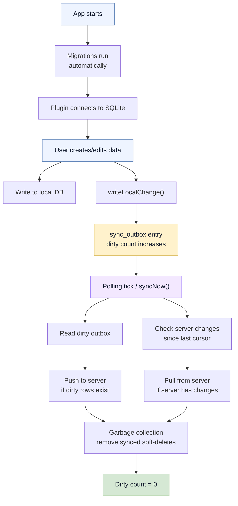

# Running in Production

You've built your app, tested it locally, and now you're shipping it to real users. This section covers what happens after that: how to configure Baresync for production, monitor sync health, handle failures, and tune performance.

## The sync lifecycle at runtime

Every time your app syncs, this is what happens:



Most of this is automatic. Your job is to configure it correctly, verify it's working, and fix it when it breaks.

## What to monitor

Three numbers tell you if sync is healthy:

| Metric | API | Healthy | Problem |
|---|---|---|---|
| **Dirty count** | `getState().local_dirty_count` | `0` | Unsynced changes are accumulating |
| **Last watermark** | `getState().last_server_watermark` | Non-empty string after first sync | Empty = never synced, stale = pull isn't advancing |
| **Needs baseline** | `getState().needs_baseline_sync` | `false` after first sync | `true` = cursor is missing, full resync needed |

If polling is enabled, also check `getPollingStatus()`:

| Field | Meaning |
|---|---|
| `running` | The polling loop is active |
| `paused` | Paused because window lost focus (if `poll_on_background` is `false`) |
| `last_sync_at` | Timestamp of the last completed sync cycle |

## Authenticated sync

If your server requires auth headers for sync endpoints, you need to manage the header lifecycle in your app. The plugin sends custom headers with every sync HTTP request, but does not handle token refresh or login itself.

### JS-owned login

When your frontend handles login (e.g. OAuth, email/password), set headers from JS after receiving the token:

```ts
const token = await login(username, password);
await syncClient.setHeaders({ Authorization: `Bearer ${token}` });
await syncClient.startPolling();
```

On logout, clear headers and stop polling:

```ts
await syncClient.stopPolling();
await syncClient.setHeaders({});
```

### Rust-owned secure storage

For apps that store tokens in the OS keychain via Rust, read the token from Rust and call `set_headers_with_state` during plugin setup. That keeps the native-owned credential path on the Rust side and writes into the same shared header store used by the JS client.

### Token refresh

When tokens expire, the server returns 401. Handle this in your app:

1. Catch 401 sync errors (check for `kind: "auth"`)
2. Refresh the token using your auth provider
3. Call `setHeaders` with the new token
4. The next polling cycle or manual `syncNow()` will use the updated headers

```ts
async function syncWithAuthRefresh() {
  try {
    await client.syncNow();
  } catch (error) {
    if (isAuthError(error)) {
      const newToken = await refreshToken();
      await client.setHeaders({ Authorization: `Bearer ${newToken}` });
      await client.syncNow();
    } else {
      throw error;
    }
  }
}
```

### Static headers via builder

For non-session headers (API keys, client version), use the Rust builder:

```rust
BaresyncBuilder::new()
    .headers(vec![("X-Api-Key", "static-key")])
```

These are set once at startup. Use `setHeaders` from JS to add or replace headers at runtime.

## Where to go next

| I need to... | Go to |
|---|---|
| Set up config for production | [Configuration](/docs/running-in-production/configuration) |
| Add or update database migrations | [Managing Migrations](/docs/running-in-production/managing-migrations) |
| Wipe local state and start over | [Resetting Local DB](/docs/running-in-production/resetting-local-db) |
| Build a sync health indicator | [Monitoring Sync Health](/docs/running-in-production/monitoring-sync-health) |
| Debug a sync failure | [Troubleshooting](/docs/running-in-production/troubleshooting) |
| Tune push performance | [Performance](/docs/running-in-production/performance) |
