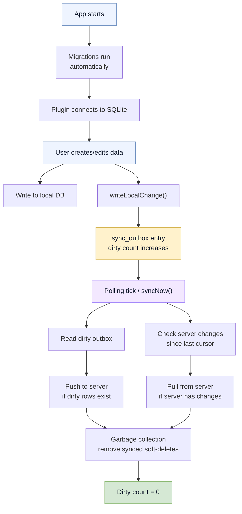

# Running in Production

You've built your app, tested it locally, and now you're shipping it to real users. This section covers what happens after that: how to configure Baresync for production, monitor sync health, handle failures, and tune performance.

## The sync lifecycle at runtime

Every time your app syncs, this is what happens:

Most of this is automatic. Your job is to configure it correctly, verify it's working, and fix it when it breaks.

## What to monitor

Three numbers tell you if sync is healthy:

| Metric | API | Healthy | Problem |
|---|---|---|---|
| **Dirty count** | `getState().local_dirty_count` | `0` | Unsynced changes are accumulating |
| **Last watermark** | `getState().last_server_watermark` | Non-empty string after first sync | Empty = never synced, stale = pull isn't advancing |
| **Needs baseline** | `getState().needs_baseline_sync` | `false` after first sync | `true` = cursor is missing, full resync needed |

If polling is enabled, also check `getPollingStatus()`:

| Field | Meaning |
|---|---|
| `running` | The polling loop is active |
| `paused` | Paused because window lost focus (if `poll_on_background` is `false`) |
| `last_sync_at` | Timestamp of the last completed sync cycle |

## Where to go next

| I need to... | Go to |
|---|---|
| Set up config for production | [Configuration](/docs/running-in-production/configuration) |
| Add or update database migrations | [Managing Migrations](/docs/running-in-production/managing-migrations) |
| Wipe local state and start over | [Resetting Local DB](/docs/running-in-production/resetting-local-db) |
| Build a sync health indicator | [Monitoring Sync Health](/docs/running-in-production/monitoring-sync-health) |
| Debug a sync failure | [Troubleshooting](/docs/running-in-production/troubleshooting) |
| Tune push performance | [Performance](/docs/running-in-production/performance) |
