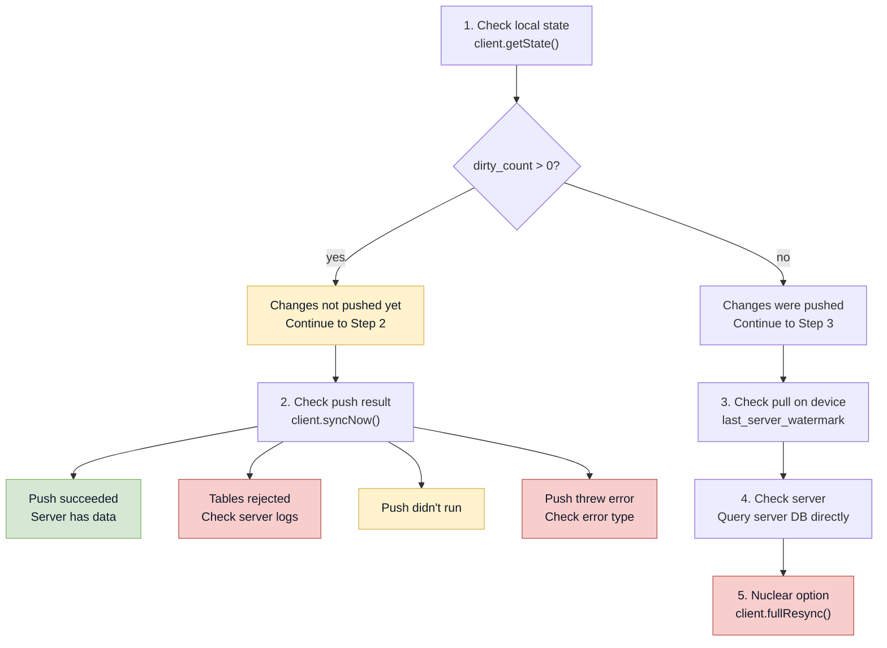

# Troubleshooting

Sync fails silently most of the time — the polling loop swallows errors and retries. This page helps you diagnose what went wrong when it stops self-healing.

## Error types

The sync engine reports errors as `SyncError` variants. Here's what each one means:

| Error | Cause | Fix |
|---|---|---|
| `SyncError::Network(msg)` | No internet, DNS failure, server unreachable | Check connectivity. The polling loop retries automatically. |
| `SyncError::Http { status, body, kind }` | Server returned an error. See [HTTP errors](#http-status-codes) below. | Depends on the status code. |
| `SyncError::Database(msg)` | SQLite error: query failed, table missing, constraint violation | Check your migrations ran. Check DB file permissions. |
| `SyncError::Validation(msg)` | Push data doesn't match the contract schema | Compare your generated artifacts with the server's contract. |
| `SyncError::JsonParse(msg)` | JSON parse error in sync response body | Ensure server returns valid JSON; check contract version matches client. |
| `SyncError::Migration(msg)` | Migration SQL failed | Fix the migration SQL. Delete DB and restart if needed. |
| `SyncError::SingleRowTooLarge { table, id }` | One row exceeds the server's `maxBytes` limit | Reduce the row's data size, or increase the server's `maxBytes`. This can't be auto-retried. |

## HTTP status codes

When the sync engine gets an HTTP error from your server, it classifies the response:

### 401 / 403 — Auth failure

```txt
kind: "auth"
```

The server rejected the request because the scope isn't authorized. This happens when:

- The `scopeId` doesn't exist on the server
- The user's session expired
- The scope resolver returned `{ ok: false }`

**Fix**: Check that the `scopeId` in your `SyncClient` config matches a scope the server recognizes. If you use auth, ensure tokens are valid.

If your server requires auth headers, verify they are set:

```ts
// After login
await client.setHeaders({ Authorization: `Bearer ${token}` });

// After token refresh
await client.setHeaders({ Authorization: `Bearer ${newToken}` });

// On logout
await client.setHeaders({});
await client.stopPolling();
```

Common auth header issues:

- **Headers never set** — `setHeaders` was never called after login. The plugin sends requests without auth headers.
- **Expired token** — The token was valid when set but has since expired. Refresh tokens before they expire or catch 401 errors and refresh + retry.
- **Cleared after re-render** — If the client is recreated on re-render (wrong pattern), headers are lost. Create the client once with `useState` or `useRef`.

### 409 — Idempotency conflict

```txt
kind: "unknown" (status 409)
code: "sync_idempotency_conflict"
```

A push with the same idempotency key is already in progress, or completed with a different body. This usually means:

- The client sent a duplicate push
- A previous push timed out client-side but succeeded server-side

**Fix**: This is usually self-resolving. The polling loop retries, and the server returns the previous result for the same key. If it persists, check `sync_batch_requests` on the server for stale entries and run `cleanupSyncBatchRequests`.

### 413 — Payload too large

```txt
kind: "payload_too_large"
code: "sync_payload_too_large"
```

The push body exceeds the server's `maxBytes` or `maxRows` limit.

**Fix**: The engine automatically splits the chunk in half and retries. If a **single row** is too large, it fails with `SingleRowTooLarge`. Reduce the row's data or increase the server's `maxBytes`.

### 400 — Invalid cursor

```txt
code: "sync_cursor_invalid"
```

The cursor format is wrong. Expected: `sync:{timestamp}:{table}:{rowId}`.

**Fix**: Call `fullResync()` to clear the cursor and start fresh.

### 500–599 — Server error

```txt
kind: "server"
```

Your server threw an unhandled error.

**Fix**: Check server logs. This is a bug in your server code, not in the sync engine.

## Diagnostic flowchart: "My data isn't syncing"



## Common failure patterns

### "Dirty count never reaches 0"

Symptoms: `getState().local_dirty_count` stays positive after multiple sync cycles.

Diagnosis:

```ts
// Check if push is succeeding
const result = await client.syncNow();
if (result.push?.tables_synced.length === 0) {
  console.log("Push ran but synced nothing");
  console.log("Rejected tables:", result.push?.rejected_tables);
}
```

Common causes:
- **Server rejecting with 409** — idempotency conflict. Check `sync_batch_requests` table.
- **Server rejecting with 413** — payload too large. The auto-retry should handle this, but `SingleRowTooLarge` can't be retried.
- **Scope mismatch** — outbox entries have a different `scope_id` than the sync client. Check `sync_outbox.scope_id` vs your client config.

### "Data appears on one device but not another"

- The sending device hasn't pushed yet (dirty count > 0)
- The receiving device's cursor is ahead of the new data (stale watermark)
- The two devices use different `scopeId` values
- The server has a bug in its scope resolution

### "Server receives unexpected sync payloads"

- The plugin is still using the default JSON transport
- The server route is still wired to a JSON handler

Check the route handlers and the `Content-Type` header first.

### "Protobuf decode failed after a schema change"

This usually means the generated artifacts are stale or the field numbers drifted.

Check:
1. Regenerate the JSON artifacts in the contract package and the app crate
2. Re-commit `sync-contract.json` and `sync-table-order.ts`
3. Confirm the Drizzle column order did not change
4. Confirm client, plugin, and server are all running the same contract version

### "Sync works but is slow"

See [Performance](/docs/running-in-production/performance) for tuning polling interval and understanding the default chunking behavior.

### "App crashes on startup after migration"

Bad migration SQL. The engine logs the error. Fix the SQL, delete the DB file, and restart:

```ts
await requestLocalDatabaseResetOnNextLaunch();
await relaunchApp();
```

The reset should delete the DB before the plugin opens SQLite again. See [Resetting Local DB](/docs/running-in-production/resetting-local-db).

### "`needs_baseline_sync` stays `true` after syncing"

The cursor isn't being saved. This means SQLite writes are failing silently.

Check:
1. DB file path is writable
2. Disk isn't full
3. DB file isn't read-only (can happen on Android if you point to the wrong directory)

### "Field numbers don't match after a schema change"

If a server starts rejecting bodies or decoded rows come back wrong after a contract edit, compare the generated artifacts against the committed files and make sure the table definitions were not reordered.

## Inspecting internal tables (last resort)

If the API-based diagnosis above isn't enough, you can query Baresync's internal tables directly through Drizzle. This is for debugging only — don't build features on these tables:

```ts
import { syncCursors, syncOutbox } from "@repo/sync-contract/local-schema";

// Check pending outbox entries
const pending = await db
  .select()
  .from(syncOutbox)
  .where(sql`synced_at IS NULL`);

// Check stored cursors
const cursors = await db.select().from(syncCursors);
```

Key columns in `sync_outbox`:

| Column | Meaning |
|---|---|
| `table_name` | Which table the change is for |
| `row_id` | Which row changed |
| `operation` | `"insert"`, `"update"`, or `"delete"` |
| `scope_id` | The scope this change belongs to |
| `synced_at` | `NULL` = pending. Timestamp = successfully pushed. |
| `changed_at` | When the change was recorded |

Key columns in `sync_cursors`:

| Column | Meaning |
|---|---|
| `scopeId` | The scope this cursor belongs to |
| `lastCursor` | The watermark string |
| `updatedAt` | When the cursor was last updated |
