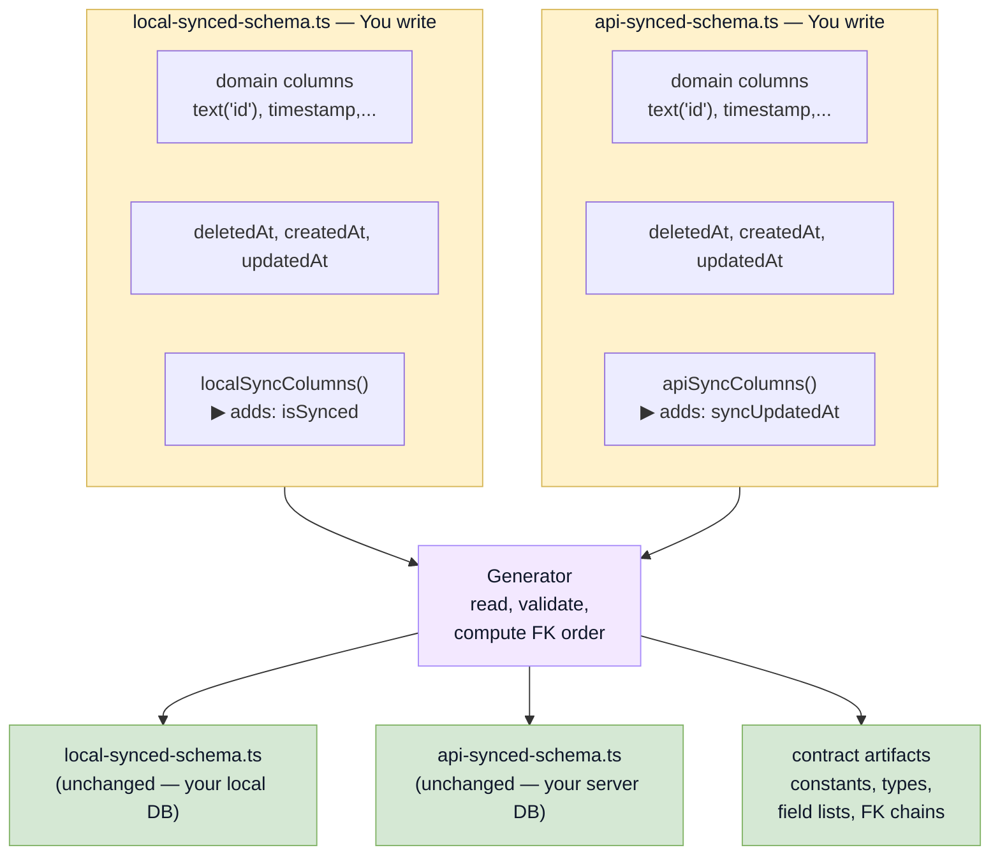

# Schema Overview

Baresync uses **paired Drizzle schemas** — one for the local app database and one for the server database. Both define the same synced tables but with different sync-tracking columns.

The schemas live in a shared sync contract package so the app and server always agree on table names, column names, and scope fields.

## The pairing

Both sides share the same domain columns and the `deletedAt` column.

## What every synced table needs

- A `text("id")` primary key
- A scope column (e.g., `scopeId`) that partitions data
- `deletedAt` for soft-delete tracking
- `createdAt` and `updatedAt` timestamps
- Either `isSynced` (local) or `syncUpdatedAt` (API)

## The schemas you write

The generator reads both synced schemas, validates them, computes table ordering from foreign keys, and outputs contract artifacts.

## Next steps

- [Synced Tables](/docs/schema/synced-tables) — how to define a synced table
- [Local Sync Columns](/docs/schema/local-sync-columns) — what `localSyncColumns()` adds
- [API Sync Columns](/docs/schema/api-sync-columns) — what `apiSyncColumns()` adds
- [Runtime Tables](/docs/schema/runtime-tables) — outbox, cursors, batch requests, and factory functions
