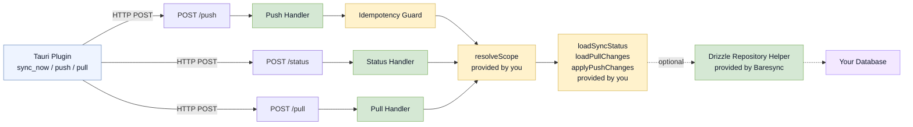

# Server Overview

Baresync does **not** provide a hosted server. It provides a grouped sync server API and lower-level helpers that you use to build sync routes in your own server (Hono, Elysia, Express, or any JS runtime).

## Package

```ts
import { createSyncServer } from "baresync/server";
```

The `"baresync/server"` sub-path exports `createSyncServer`, low-level primitives, and types.

## The three routes

Your server needs three `POST` endpoints:

| Route | Purpose | Handler factory |
|---|---|---|
| `/status` | "Are there changes since this cursor?" | `syncServer.status` |
| `/pull` | "Give me all changed rows since this cursor" | `syncServer.pull` |
| `/push` | "Here are my local changes, write them" | `syncServer.push` |

Use `createSyncServer` to wire all three at once. For custom protocol work, use the low-level primitives exported from `baresync/server`.

## What Baresync provides

Each sync endpoint handles:

- Request body decoding (JSON)
- Field validation (required fields present)
- Push payload size limits
- Push change ordering (respects `upsertOrder`)
- Idempotency guard (prevents duplicate push processing)
- Scope resolution (calls your callback)
- Response envelope formatting
- Error mapping to structured error codes

## What you provide

- **Scope resolution** — verify the client is authorized for the requested scope
- **Database operations** — read and write rows for each table
- **The server itself** — Hono, Express, Bun, etc.

## The Drizzle repository helper

If you use Drizzle ORM on the server, `createDrizzleSyncRepository` from `baresync/server/drizzle` implements the database operations for you. You provide per-table callbacks (`buildRow`, `readRows`, `upsertRow`, `softDeleteRow`) and the helper wires them into the grouped server.

## Architecture



`createSyncServer` wires one endpoint bundle and calls your callbacks:

| Route | Factory | Calls your |
|---|---|---|
| `POST /status` | `syncServer.status` | `resolveScope` + `loadSyncStatus` |
| `POST /push` | `syncServer.push` | `resolveScope` + idempotency guard + `applyPushChanges` |
| `POST /pull` | `syncServer.pull` | `resolveScope` + `loadPullChanges` |

## Next steps

- [Route Shape](/docs/server/route-shape) — request/response envelopes
- [Scope Resolution](/docs/server/scope-resolution) — authorization and tenant mapping
- [Status Handler](/docs/server/status-handler) — has-changes check
- [Pull Handler](/docs/server/pull-handler) — returning changed rows
- [Push Handler](/docs/server/push-handler) — accepting local changes
- [Idempotency](/docs/server/idempotency) — preventing duplicate processing
- [Cursors](/docs/server/cursors) — how cursors work
- [Drizzle Repository Helper](/docs/server/drizzle-repository-helper) — the easy path
- [Low Level Primitives](/docs/server/low-level-primitives) — building without the helper
- [Errors](/docs/server/errors) — error codes and HTTP status mapping
