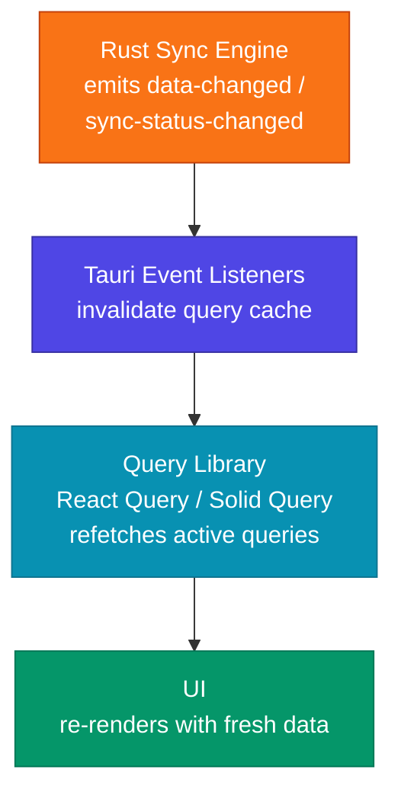

# UI Frameworks Overview

Baresync does not ship a dedicated React or SolidJS package. The core library (`baresync/tauri`, `baresync/db`) is framework-agnostic — it exports plain TypeScript functions and types with no UI dependencies.

The integration pattern is the same for any framework:

1. **Create a `SyncClient`** via `createSyncClient`
2. **Provide it to your component tree** (context, store, or DI)
3. **Listen for Tauri events** (`baresync://data-changed`, `baresync://sync-status-changed`) to trigger re-fetches
4. **Use a query library** (React Query, Solid Query) to fetch data from the local SQLite via Drizzle

## The event-driven loop

You never poll the database from the UI. The Rust engine emits events when observable data changes, and your query library handles the rest.

## Sections

| Page | What it covers |
|---|---|
| [React](/docs/ui-frameworks/react) | Provider, hooks, React Query integration, full examples |
| [Solid](/docs/ui-frameworks/solid) | Solid Query equivalent of the React patterns |
| [Framework-Agnostic Patterns](/docs/ui-frameworks/framework-agnostic-patterns) | SyncClient setup, event handling, write patterns that work everywhere |
